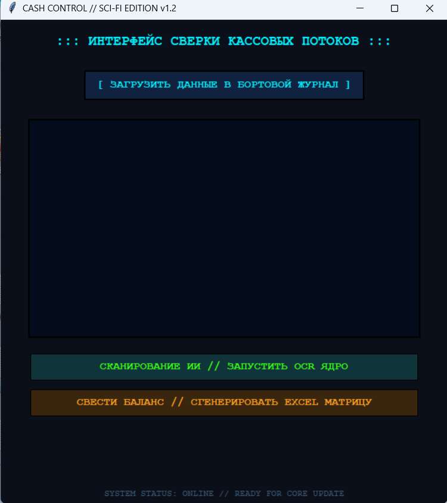

# KARABAS Cash Control

Public showcase of an AI-assisted document processing workflow for small-business cash reporting.

## What the project does

The private working version processes photos of receipts and handwritten shift reports, extracts structured financial data with an AI model, classifies expenses, and prepares data for export into an existing Excel workflow.

## Public architecture

Image / receipt
→ AI document understanding
→ structured JSON
→ validation schema
→ Python processing
→ Excel export

## What this repository demonstrates

- AI-assisted document processing
- structured model output
- schema validation
- expense classification workflow
- Excel automation concept
- desktop workflow prototyping

## Private components

The original implementation contains business-specific categories, prompts, Excel mapping logic and customer-specific workflow details. Those parts are intentionally not published.

## Tech used in the private version

Python, Gemini API, Pydantic, JSON, Pillow, OpenPyXL, Tkinter

## Status

Showcase repository. Customer-specific business logic and production configuration are kept private.
